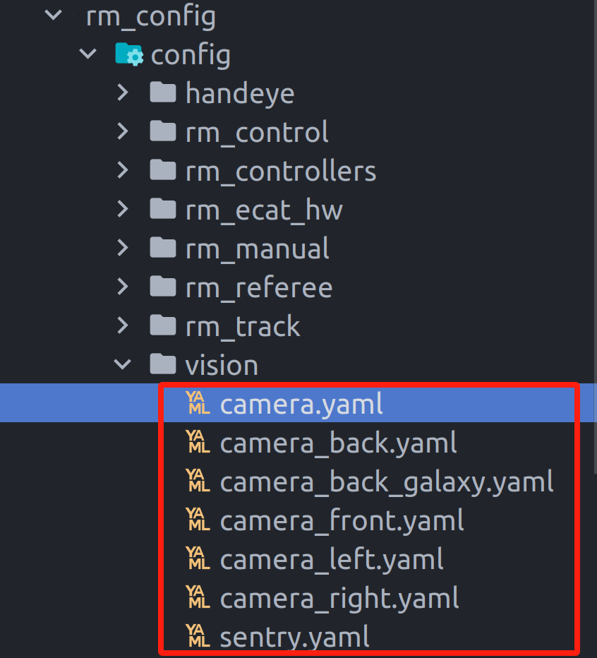
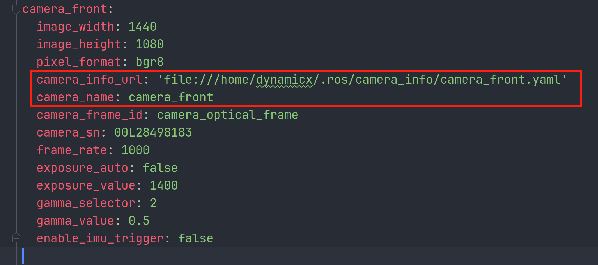

# hk_camera
ROS wrapper for the hk camera made by Hikrobot.

# Install dependencies
Dependencies:
- ROS Noetic
- libMvCameraControl.so  download `MVS_STD_GML_V**` from
[here](https://www.hikrobotics.com/cn/machinevision/service/download?module=0)
>download the lastest, or the same version in the robots
# 跑hk没有compressed话题

```shell
sudo apt-get update
sudo apt-get install ros-noetic-image-transport-plugins
```
重新跑即可

# Calibrattion steps

## 车上标定

1. 小电脑上停掉所有视觉服务(标定帧率低)，单跑相机
```shell
stopvi
mon launch hk_camera singe_device.launch
```

2. 在自己电脑上跑标定程序
```shell
rosrun camera_calibration cameracalibrator.py --size 11x8 --square 0.020 image:=/hk_camera/image_raw camera:=/hk_camera
```
Tips:
* size：the size of the inner corners of the chessboard.(是内部角点的数量，不是棋盘格的格子数)
* square：the length of each square (unit：m).

3. 开始标定，直至caliberate出现绿色后，点击后，等命令行有反应后再点save，此时标定文件会保存在/tmp下(命令行会显示)

4. cd进/tmp，将标定文件传进小电脑的/.ros/camera_info/中
```shell
cd /tmp/calibrationdata
scp xxxx.yaml dynamicx@192.168.100.2:/home/dynamicx/.ros/camera_info/
```

5. 修改参数文件


(改哪个文件要看rm_config/launch/vision/camera.launch里加载的是哪个yaml,一般是camera.yaml)


修改下面两个参数
* camera_info_url:对应标定文件的路径(为空默认路径为file:///home/dynamicx/.ros/camera_info/hk_camera.yaml)
* camera_name:相机名字，对应标定文件中的camera_name

改完后把参数文件传到车上

6. 修改小电脑中对应标定文件的名字和里面的camera_name

## 直连相机标定

同车上标定一样，在自己电脑上标定完后，把标定文件传到车上即可(记得改yaml)

More information:

- http://wiki.ros.org/image_pipeline

# Other Warnings
## 1. 相机强制使用libMvCameraControl.so
在编译的时候，必须指定libMvCameraControl.so的路径，否则会报错找不到libMvCameraControl.so
```shell
# 使用cmake强制指定
cmake -DCMAKE_BUILD_TYPE=Release -DCMAKE_PREFIX_PATH=/path/to/libMvCameraControl.so ..
# 或者像Cmakelist.txt一样，用绝对路径强制指定
set(MVS_LIBRARY /opt/MVS/lib/64/libMvCameraControl.so)
```
## 2. 其他包需要用libusb.so但是报错（建议提前修复）
首先搞清楚2个东西：
- libusb-1.0.so.0：libusb的动态库，通常在/usr/lib/x86_64-linux-gnu/下
- libusb.so：libusb的开发库，通常在/usr/lib/x86_64-linux-gnu/下

有关以上任何的问题，提前检查你是不是链接到了/opt/MVS/lib/下的libusb，这个库过于老旧，已经弃用，只给hk_camera()使用。

解决方案：
- 强制指定libusb指向pcl的libusb
- 删除.bashrc中对libusb的指定（每次安装MVS驱动都要弄）
- CmakeLists.txt中使用别名（这里就是）